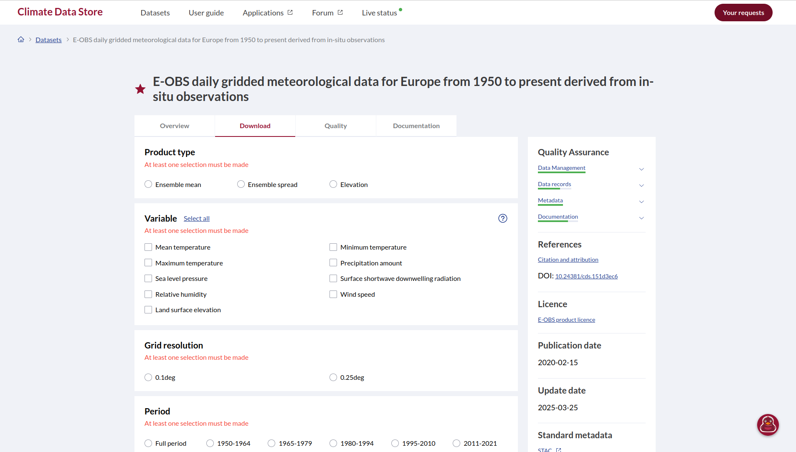
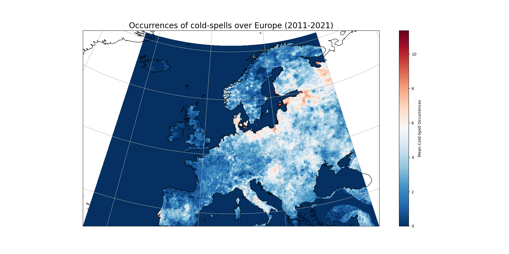

*************************
Cold-Spell Duration Index
*************************

About
=====
In this tutorial, we will show you haw to calculate the :ref:`Cold-Spell Duration Index<csdi>` (CSDI), using data provided by Copernicus Climate Change Service (`C3S`_).

After preparing our environment, we will download the daily minimum temperature data from C3S `Climate Data Store`_, inspect them and use the :mod:`icclim` library to calculate the CSDI. Finally, we will display the CSDI using :mod:`matplotlib` to end up with the following map.

.. image:: E_OBS_csdi_index.png
    :align: center
    :alt: European map of the Cold-Spell Duration Index

.. _C3S: https://climate.copernicus.eu/
.. _Climate Data Store: https://cds.climate.copernicus.eu/

Required libraries
==================
.. important::
    Before anything, we need to have a Python virtual environment set up. If necessary, :ref:`here<pyVirtualEnv>` is how to set it up.

Additionally to :mod:`icclim`, to work the following example, we will need:

.. code-block:: python

    # to download data
    import urllib3 # will disable warning for data download though API
    import cdsapi # Climate Data Store API
    
    # to extract data from archive file
    from zipfile import ZipFile
    
    # of course:
    import icclim

    # to enable plotting
    import matplotlib.pyplot as plt
    import cartopy

If some of these libraries miss in our virtual environment, we need to run the following install commands in the console:

.. code-block:: python

    %pip install cartopy
    %pip install matplotlib
    %pip install cdsapi
    %pip install icclim
    %pip install utllib3

.. note::
    ``%`` ensures that the libraries installation occurs in our virtual environment.

.. note::
    ZipFile is Python Standard Library which is installed with Python installation.

Data download and data call
===========================
Climate Data Store API key set-up
---------------------------------
Since we will work with the minimum temperature data from C3S `Climate Data Store`_ (CDS), we will need first to `log in, or register`_, to the CDS. Once logged in, we retrieve can retrieve the API URL, as well as our CDS API key:

.. _log in, or register: https://accounts.ecmwf.int/auth/realms/ecmwf/protocol/openid-connect/auth?client_id=cds&scope=openid%20email&response_type=code&redirect_uri=https%3A%2F%2Fcds.climate.copernicus.eu%2Fapi%2Fauth%2Fcallback%2Fkeycloak&state=nyS6TnhZ00Dp6WUovTTWs3rDWLoAbV0-TsmZjH678L8&code_challenge=y49Rc-vRJVxgVgQ56tWI2dQGIuRBSkQw8EzlE2Zugso&code_challenge_method=S256

We copy and paste them into a URL and KEY variable respectively.

.. code-block:: python

    URL = 'https://cds.climate.copernicus.eu/api'
    KEY = '<PERSONAL-ACCESS-TOKEN>'

Data download
-------------
As we saw it at the beginning of this tutorial, we will need daily minimum temperature data. Data for this parameter are available as part of the E-OBS daily gridded meteorological data for Europe from 1950 to present. For this exercise we select a shorter period to allow a faster download: we will pick the period from 2011 to 2021.
In the frame of this tutorial, we will specifically use the **E-OBS daily gridded meteorological data for Europe from 1950 to present derived from in-situ observations** data set, which can be found using the search bar from CDS `home page <Climate Data Store>`__.
Having selected the data set from the search results page, we now need to specify what product type, variables, temporal and geographic coverage we are interested in. These can all be selected in the **"Download data"** tab (see picture below).

We select the following parameters to refine our data selection :

* Product type: **Ensemble mean**
* Variable: **Minimum temperature**
* Grid resolution: **0.1deg** 
* Period: **2011-2021**
* Version: **25.0e** (in "All other available versions")

Then at the bottom of the form appears a code block which we can copy and paste in our script.

.. code-block:: python

    # DATA DIRECTORY & FILE NAME DEFINITION
    data_dir = './data/CSDI/'
    filename = 'eobs_tasmin.zip'

    # API CODE BLOCK
    dataset = "insitu-gridded-observations-europe"
    request = {
        "product_type": "ensemble_mean",
        "variable": ["minimum_temperature"],
        "grid_resolution": "0_1deg",
        "period": "2011_2021",
        "version": ["25_0e"]
        }

    client = cdsapi.Client()
    client.retrieve(dataset, request, f'{data_dir}{filename}').download()

.. note::
    Since we already imported :mod:`cdsapi` library, we can skip that code line in the generated code block.

.. note::
    The data directory we defined before the CDS API code block will be used for both data download and to our :mod:`icclim` output file

Before running the code block, we need to accept the terms and conditions of this specific data set on the CDS form. When the code is run in our environment, we will receive the daily minimum temperature in a zip archive.

Extract Data
------------
As we just saw, the retrieved data are in a zip format. Before going any further, we need first to decompress the archive and retrieve the filename. This is done with zipfile library.

.. code-block:: python

    # Create a ZipFile Object and load eobs_pr.zip in it
    with ZipFile(f"{DATADIR}/eobs_tasmin.zip", "r") as zip_obj:
        # Get a list of all archived file names from the zip
        list_of_file_names = zip_obj.namelist()
        # Extract all the contents of zip file in current directory
        zip_obj.extractall()

    # List the NetCDF filenames of the dataset

:mod:`list_of_file_names` will be then used as input parameter in icclim.

Parameters definition
=====================
Now that we managed to load the data we need, we can prepare our icclim input parameters:

.. code-block:: python

    index = 'CSDI'
    input_f = list_of_file_names
    slice_mode = 'year'

    output_f = f“{data_dir}out_icclim_CSDI_2011_to_2021.nc”

Calculate the Cold-Spell Duration Index
=======================================
Our data and parameters are finally set-up. It is time to calculate the CSDI. The function can be called either by calling directly :mod:`icclim.csdi()` or using the index name as an input parameter :mod:`icclim.index(index_name = “CSDI”)`.
Both calls will return the same results, independently the calling method. Here we choose the latter one.

.. code-block:: python

    csdi = icclim.index(index_name = index, in_files  = input_f,
                        slice_mode = slice_mode, out_file = output_f)

Before jumping to the plot section, let’s have a look at the data we just created:

.. code-block::

    csdi

The created dataset is of :mod:`xarray.Dataset` type. Along with the coordinates (lon, lat, time, bounds), the data variable (CSDI), and indexes (for lon, lat, time, bounds) we can find additional information in Attributes. We will find the long title of the index (LATER CHECK), as well as the reference on the index calculation (European Climate Assessment & Dataset (ECA&D)).

CSDI Data analysis
==================
With our index now calculated, let’s bring the CSDI to life by mapping its mean across Europe, over our selected time period. For the area of interest, we will take the same European subset as in the `C3S Climate Bulletins <bulletins>`__.

.. _bulletins: https://climate.copernicus.eu/climate-bulletin

.. code-block::

    # Calculate CSDI mean over time
    csdi_mean = csdi['CSDI'].mean(dim = 'time', keep_attrs = True)

    # Set spatial extend and center it
    extent = [-25, 40, 34, 72]  # Western Europe    
    central_lat = 53.0
    central_lon = 7.5

    # Select European subset
    csdi_sub = csdi_avg.where(
        (csdi_avg.latitude < 72)
        & (csdi_avg.latitude > 34)
        & (csdi_avg.longitude < 40)
        & (csdi_avg.longitude > -25),
        drop=True,
    )

    # Select map projection
    map_proj = ccrs.AlbersEqualArea(central_longitude=central_lon, 
                                    central_latitude=central_lat)

    # Define plot
    f, ax = plt.subplots(figsize=(18, 9), subplot_kw={"projection": map_proj})

    # Plot data
    csdi_subset.plot(cmap = plt.cm.RdBu_r, transform = ccrs.PlateCarree(),
                cbar_kwargs = {
                    'orientation' : 'vertical',
                    'label' : 'Mean Cold-Spell Occurrences'
                })
    # Plot information
    plt.title('Occurences of cold-spells over Europe (2011-2021)', fontsize = 20)

    # Add the coastlines to axis and set extent
    ax.coastlines()
    ax.gridlines()
    ax.set_extent(extent)

    # Save plot as png
    plt.savefig(f'{data_dir}E-OBS_csdi_mean_over_Europe_2011to2021.png')

As we can notice on our output map, over the period 2011-2021, occurrences of cold-spells is rather steady over Western Europe. Cold-spells mostly happened more often in Denmark, near Black Sea southern coast.