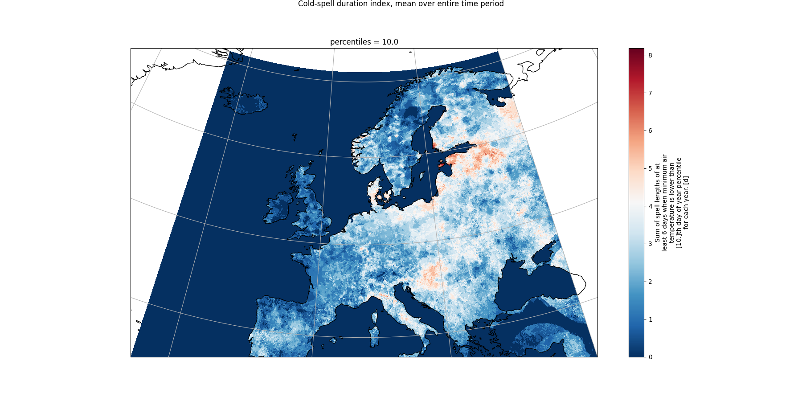

*************************
Cold-Spell Duration Index
*************************

About
=====
In this tutorial, we will show you haw to calculate the :ref:`Cold-Spell Duration Index<csdi>` (CSDI), using data provided by Copernicus Climate Change Service (`C3S`_).

After preparing our environment, we will download the minimum temperature data from C3S `Climate Data Store`_, inspect them and use the :mod:`icclim` library to calculate the CSDI. Finally, we will display the CSDI using :mod:`matplotlib` to end up with the following map.

.. _C3S: https://climate.copernicus.eu/
.. _Climate Data Store: https://cds.climate.copernicus.eu/

Required libraries
==================
.. important::
    Before anything, we need to have a Python virtual environment set up. If necessary, :ref:`here<pyVirtualEnv>` is how to set it up.

Additionally to :mod:`icclim`, to work the following example, we will need:

.. code-block:: python

    # to download data
    import urllib3 # will disable warning for data download though API
    import cdsapi # Climate Data Store API
    
    # to extract data from archive file
    from zipfile import ZipFile
    
    # of course:
    import icclim

    # to enable plotting
    import matplotlib.pyplot as plt
    import cartopy

If some of these libraries miss in our virtual environment, we need to run the following install commands in the console:

.. code-block:: python

    %pip install cartopy
    %pip install matplotlib
    %pip install cdsapi
    %pip install icclim
    %pip install utllib3

.. note::
    ``%`` ensures that the libraries installation occurs in our virtual environment.

.. note::
    ZipFile is Python Standard Library which is installed with Python installation.

Data download and data call
===========================
Climate Data Store API key set-up
---------------------------------
Since we will work with the minimum temperature data from C3S `Climate Data Store`_ (CDS), we will need first to `log in, or register`_, to the CDS. Once logged in, we retrieve can retrieve the API URL, as well as our CDS API key.

.. _log in, or register: https://accounts.ecmwf.int/auth/realms/ecmwf/protocol/openid-connect/auth?client_id=cds&scope=openid%20email&response_type=code&redirect_uri=https%3A%2F%2Fcds.climate.copernicus.eu%2Fapi%2Fauth%2Fcallback%2Fkeycloak&state=nyS6TnhZ00Dp6WUovTTWs3rDWLoAbV0-TsmZjH678L8&code_challenge=y49Rc-vRJVxgVgQ56tWI2dQGIuRBSkQw8EzlE2Zugso&code_challenge_method=S256